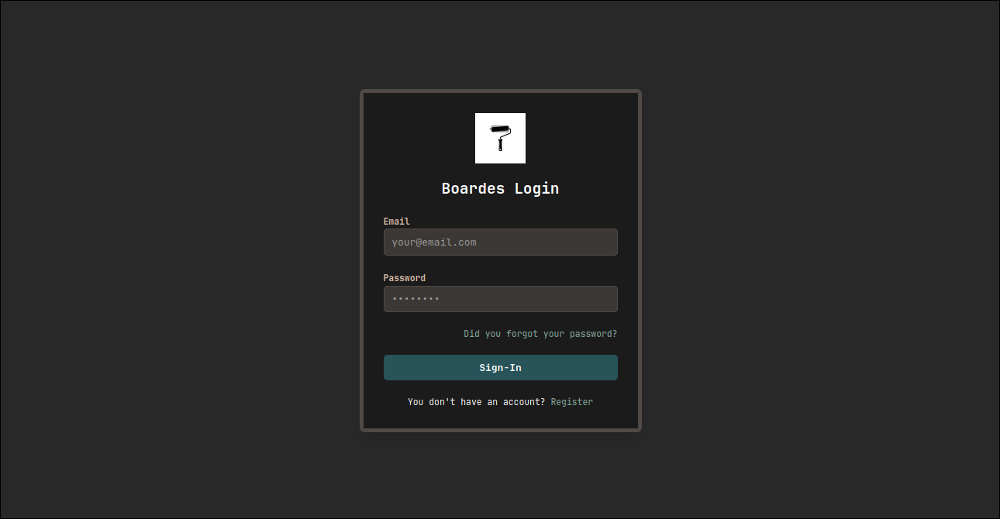
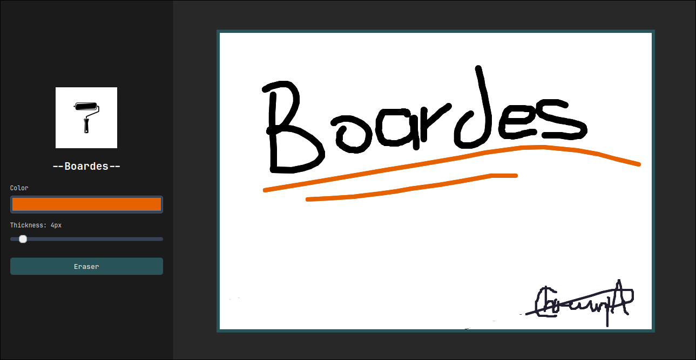
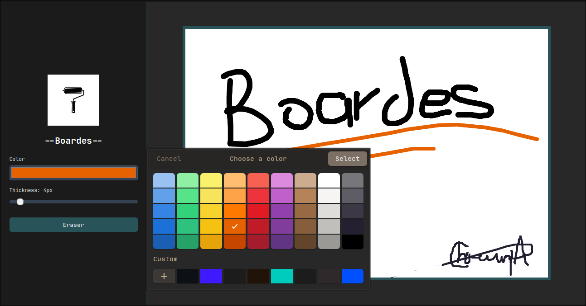
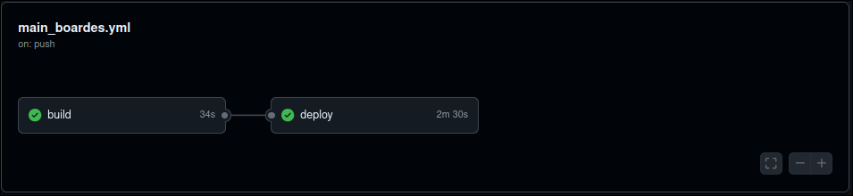

<div align="center">
    <h1 align="center">Boardes</h1>
    <p align="center">
A web-based interactive whiteboard application that allows multiple users to draw and collaborate in real-time.
    </p>
</div>

</br>

> [!IMPORTANT]  
> This application require of a backend with ws to works, wich uses this project as:
> - Backend: https://github.com/Andr3xDev/Boardes-back

</br>

## ✨ Features

- Real-Time Collaboration: Changes made by one user are instantly visible to all other participants on the same board.
- Secure Authentication: User registration and login powered by AWS Cognito, ensuring that only authenticated users can access the board.
- Dynamic Drawing Tools:
    - Brush: Select custom colors and stroke weights to draw freely.
    - Smart Eraser: A dedicated eraser tool that temporarily switches the brush to white. Toggling it again restores the previously selected color.
- Shared Canvas, Independent Tools: While the canvas state is synchronized across all users, each participant has their own independent tool settings.
- Persistent State: The board's state is saved on the server, so new participants will see the complete drawing history upon joining.

</br>
</br>

## 📸 Preview

Login Page



Collaborative Board





</br>
</br>

## 🛠️ Tech Stack

This project is built with a modern, full-stack architecture:

Frontend:

- React: A declarative library for building user interfaces.
- p5.js: A JavaScript library for creative coding, used here for the drawing canvas.
- Tailwind CSS: A utility-first CSS framework for rapid UI development.
- AWS Amplify: Client-side libraries for easy integration with AWS services like Cognito.

Backend:

- Java & Spring Boot: A robust framework for building the server-side application.
- WebSockets: For enabling real-time, bidirectional communication between clients and the server.

- Authentication:
- AWS Cognito: A fully managed user identity and data synchronization service.

## 🚀 Getting Started

Prerequisites:
- Node.js (v18 or later)
- Java JDK (v17 or later)
- Maven
- An AWS account with Amplify CLI configured (you can eliminate auth if you only want the board)

Running Locally by run the application on your local machine, you'll need to start both the backend and frontend servers.

### Backend (Spring Boot)

- Clone repository: 

```sh
git clone 
cd 
```

- Build the project using Maven:

```sh
mvn verify
```


- Run the application:

```sh
mvn spring-boot:run
```

The backend server will start on http://localhost:8080.


### Frontend (React)

- Clone repository: 

```sh
git clone 
cd 
```

- Install dependencies:

```sh
npm install
```

- Start the development server:
```sh
npm run dev
```

The frontend application will be available at http://localhost:5173.


## ☁️ Deployment

Deploying this application involves hosting the frontend and backend components separately and ensuring they can communicate with each other and with AWS Cognito.
For example, in this project Azure hosts all by the custom pipeline in the source code.



### Cognito Configuration

In your AWS Cognito User Pool settings, make sure to add the URL of your deployed frontend application to the list of allowed callback URLs under "App client settings" to enable successful logins in production.
